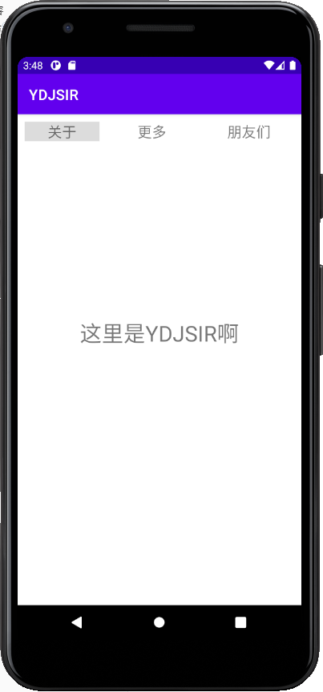
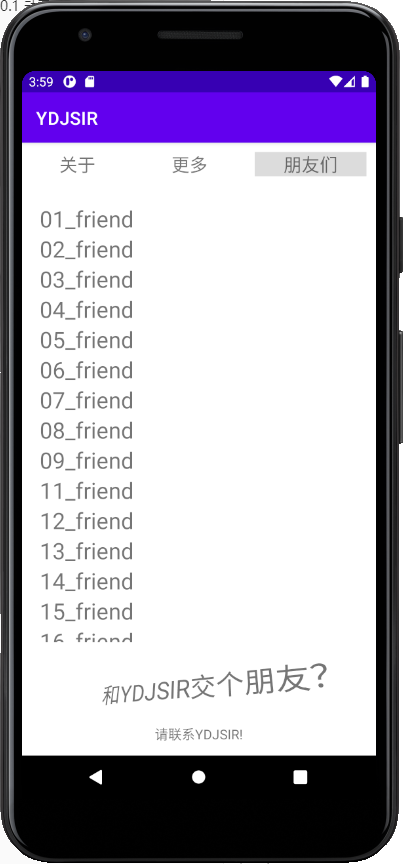
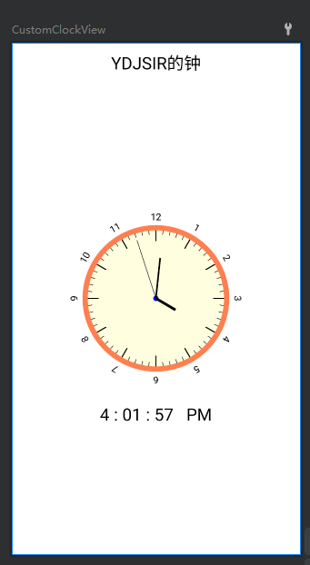
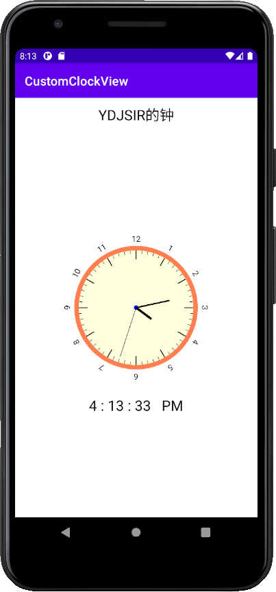

<div class="cover" style="page-break-after:always;font-family:方正公文仿宋;width:100%;height:100%;border:none;margin: 0 auto;text-align:center;">
    <div style="width:60%;margin: 0 auto;height:0;padding-bottom:10%;">
        </br>
        
    </div>
    </br></br></br></br></br>
    <div style="width:60%;margin: 0 auto;height:0;padding-bottom:40%;">
        
	</div>
    </br></br></br>
<span style="font-family:华文黑体Bold;text-align:center;font-size:24pt;margin: 10pt auto;line-height:30pt;">Android 应用开发：7月14日作业</span>
    </br>
	</br>
    <table style="border:none;text-align:center;width:90%;font-family:仿宋;font-size:14px; margin: 0 auto;line-height:1.5">
    <tbody style="font-family:方正公文仿宋;font-size:16pt;">
        <tr style="font-weight:normal;"> 
    		<td style="width:20%;text-align:right;">姓　　名</td>
    		<td style="width:2%">：</td> 
    		<td style="width:40%;font-weight:normal;border-bottom: 1px solid;text-align:center;font-family:华文仿宋"> </td>     </tr>
        <tr style="font-weight:normal;"> 
    		<td style="width:20%;text-align:right;">学　　号</td>
    		<td style="width:2%">：</td> 
    		<td style="width:40%;font-weight:normal;border-bottom: 1px solid;text-align:center;font-family:华文仿宋"> </td>     </tr>
    	<tr style="font-weight:normal;"> 
    		<td style="width:20%;text-align:right;">指导教师</td>
    		<td style="width:2%">：</td> 
    		<td style="width:40%;font-weight:normal;border-bottom: 1px solid;text-align:center;font-family:华文仿宋"> 魏君成 </td>     </tr>
    	<tr style="font-weight:normal;"> 
    		<td style="width:20%;text-align:right;">日　　期</td>
    		<td style="width:2%">：</td> 
    		<td style="width:40%;font-weight:normal;border-bottom: 1px solid;text-align:center;font-family:华文仿宋">2021年7月15日</td>     </tr>
    </tbody>              
    </table>
</div>

<div STYLE="page-break-after: always;">

[toc]

## 题目要求

### 动画与`fragment`

- 利用`ViewPagert`+`Fragment`写出一个类似页面

- 每个页面（`fragment`）中演练一种动画

- 页面中增加`RecyclerView`的使用有加分

### 钟

1. 绘制时钟界面，包括时针、分针、秒针

2. 时针、分针、秒针需要跳动
3. 时针、分针、秒针的粗细、长短不同
4. 绘制表盘上的数字（可选）
5. 用点绘制表盘刻度（可选）

## 已实现内容

### 动画与`fragment`

> 具体动画演示以及`RecycleView`可见 `Android Emulator - Pixel_3a_API_30_x86_YDJSIR_5554 2021-07-19 23-28-06.mp4` 
>
> 具体左右滑动演示可见`192.168.1.9 - 远程桌面连接 2021-07-19 23-50-13.mp4`
>
> 所有项目文件在 `Animation`目录下。

#### 页面简介

页面启动之后，可以看到一个导航栏，能指向`ViewPager`下面的三个`Fragment`。左右滑动，可以切换页面，详情见录屏`192.168.1.9 - 远程桌面连接 2021-07-19 23-50-13.mp4`。



#### 页面动画

上面的三个页面中每个页面都采取了一种独立的方式实现不同效果的动画。具体演示见录屏 `Android Emulator - Pixel_3a_API_30_x86_YDJSIR_5554 2021-07-19 23-28-06.mp4` 。核心代码如下。

##### `关于` 页面

```java
ObjectAnimator.ofFloat(textView, "translationY", -textView.getTextSize() * 2).setDuration(500).start();
```

上述代码实现了文段向上平移的效果。

##### 更多` 页面

```java
RotateAnimation animation = new RotateAnimation(-3f, 3f,
                Animation.RELATIVE_TO_SELF, 0.5f, Animation.RELATIVE_TO_SELF, 0.5f);
        animation.setRepeatCount(Animation.INFINITE);
        animation.setRepeatMode(Animation.REVERSE);
        animation.setInterpolator(new LinearInterpolator());
        animation.setDuration(512);
        textView.startAnimation(animation);
```

上述代码实现了文段整体摇晃的效果。

##### `朋友们`页面

```java
PropertyValuesHolder pvhX = PropertyValuesHolder.ofFloat(View.SCALE_X, 2);
        PropertyValuesHolder pvhY = PropertyValuesHolder.ofFloat(View.SCALE_Y, 2);
        ObjectAnimator.ofPropertyValuesHolder(textView, pvhX, pvhY).setDuration(3000).start();
```

上述代码实现了文段整体放大的效果。

#### `RecycleView` 列表

具体效果详见录屏 `Android Emulator - Pixel_3a_API_30_x86_YDJSIR_5554 2021-07-19 23-28-06.mp4`。



### 钟

> 所有项目文件在`clock`目录下。

实现效果如下图所示。显示的时间被固定为北京时间。

| Android Studio预览                                           | 模拟器运行效果                                               |
| ------------------------------------------------------------ | ------------------------------------------------------------ |
|  |  |

