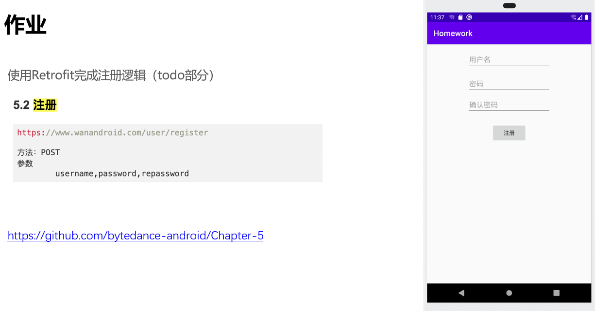
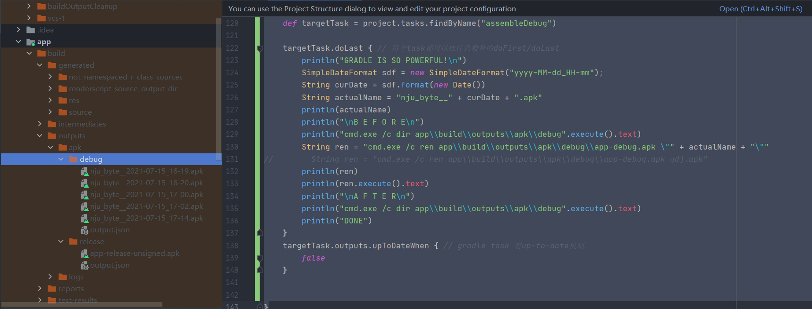
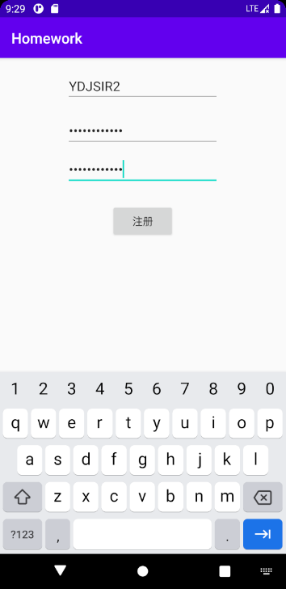
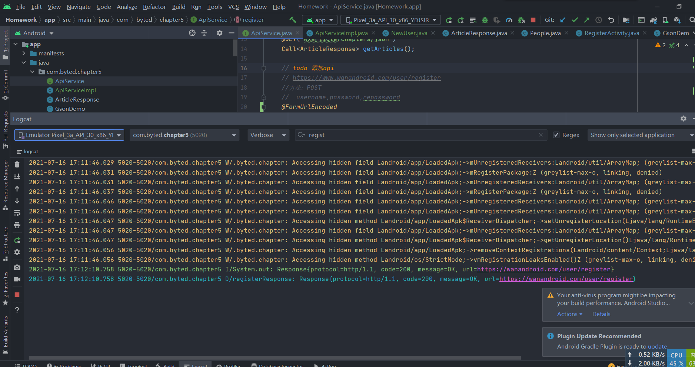

<div class="cover" style="page-break-after:always;font-family:方正公文仿宋;width:100%;height:100%;border:none;margin: 0 auto;text-align:center;">
    <div style="width:60%;margin: 0 auto;height:0;padding-bottom:10%;">
        </br>
        
    </div>
    </br></br></br></br></br>
    <div style="width:60%;margin: 0 auto;height:0;padding-bottom:40%;">
        
	</div>
    </br></br></br>
<span style="font-family:华文黑体Bold;text-align:center;font-size:24pt;margin: 10pt auto;line-height:30pt;">Android 应用开发：7月15日作业</span>
    </br>
	</br>
    <table style="border:none;text-align:center;width:90%;font-family:仿宋;font-size:14px; margin: 0 auto;line-height:1.5">
    <tbody style="font-family:方正公文仿宋;font-size:16pt;">
        <tr style="font-weight:normal;"> 
    		<td style="width:20%;text-align:right;">姓　　名</td>
    		<td style="width:2%">：</td> 
    		<td style="width:40%;font-weight:normal;border-bottom: 1px solid;text-align:center;font-family:华文仿宋"> </td>     </tr>
        <tr style="font-weight:normal;"> 
    		<td style="width:20%;text-align:right;">学　　号</td>
    		<td style="width:2%">：</td> 
    		<td style="width:40%;font-weight:normal;border-bottom: 1px solid;text-align:center;font-family:华文仿宋"> </td>     </tr>
    	<tr style="font-weight:normal;"> 
    		<td style="width:20%;text-align:right;">指导教师</td>
    		<td style="width:2%">：</td> 
    		<td style="width:40%;font-weight:normal;border-bottom: 1px solid;text-align:center;font-family:华文仿宋"> 答奇 </td>     </tr>
    	<tr style="font-weight:normal;"> 
    		<td style="width:20%;text-align:right;">日　　期</td>
    		<td style="width:2%">：</td> 
    		<td style="width:40%;font-weight:normal;border-bottom: 1px solid;text-align:center;font-family:华文仿宋">2021年7月15日</td>     </tr>
    </tbody>              
    </table>
</div>

<div STYLE="page-break-after: always;">

[toc]

## 题目要求

### 安卓构建

修改生成的`debug apk`的名字为 `nju_byte__${YYYY-MM-DD_HH-MM}.apk`，e.g. `nju_byte__2021-07-12_08-35.apk`

修改之处见`android-basics/app/build.gradle`。

### 安卓与网络



## 已实现内容

### 安卓构建部分

> 全部项目文件在`android-basics`目录下

在以如下方式修改`android-basics/app/build.gradle`的 ==TODO== 后实现题目所需效果。

```kotlin
// homework: 修改生成的debug apk的名字为: nju_byte__${YYYY-MM-DD_HH-MM}.apk, e.g nju_byte__2021-07-12_08-35.apk
project.afterEvaluate {
    /*
    要点：
    a) 找到需要hook的gradle task，这里一般是assembleDebug任务
    b) 跑一遍assembleDebug，在app/build目录下找到生成的apk路径
    c) 构造需要生成的apk的名字，然后修改apk的名字
     */
    def targetTask = project.tasks.findByName("assembleDebug")

    targetTask.doLast { // 每个task都可以挂任意数量的doFirst/doLast
        println("GRADLE IS SO POWERFUL!\n")
        SimpleDateFormat sdf = new SimpleDateFormat("yyyy-MM-dd_HH-mm");
        String curDate = sdf.format(new Date())
        String actualName = "nju_byte__" + curDate + ".apk"
        println(actualName)
        // 为了体现对比，下面的代码将会先列出改名前对应目录下的文件以展示改名前的apk，在改名命令执行后再列出改名后对应目录下的文件以展示改名的apk
        println("\nB E F O R E\n")
        println("cmd.exe /c dir app\\build\\outputs\\apk\\debug".execute().text)
        String ren = "cmd.exe /c ren app\\build\\outputs\\apk\\debug\\app-debug.apk \"" + actualName + "\""
        println(ren)
        println(ren.execute().text)
        println("\nA F T E R\n")
        println("cmd.exe /c dir app\\build\\outputs\\apk\\debug".execute().text)
        println("DONE")
    }
    targetTask.outputs.upToDateWhen { // gradle task 有up-to-date机制
        false
    }
}
```

最终执行效果如下：



### 安卓与网络部分

> 全部项目文件在`Homework`目录下。

#### 代码部分

##### 接口部分

```java
public interface ApiService {    
    // https://www.wanandroid.com/user/register
    //方法：POST
    //	username,password,repassword
    @FormUrlEncoded
    @POST("user/register")
    Call<NewUser> register(@Field("username")String username, @Field("password")String password, @Field("repassword")String repassword);
}
```

##### 使用部分

```java
Call<NewUser> registerCall = apiService.register(name, password, repassword);
registerCall.enqueue(new Callback<NewUser>() {
    @Override
    public void onResponse(Call<NewUser> call, Response<NewUser> response) {
        System.out.println(response.toString());
        Log.d("registerResponse", response.toString());
    }

    @Override
    public void onFailure(Call<NewUser> call, Throwable t) {
    Toast.makeText(RegisterActivity.this, "网络请求失败", Toast.LENGTH_SHORT).show();
        Log.d("registerResponse", "NetworkFailed");
    }
});
```

#### 运行反馈

在模拟器内运行该APP，输入账密。



点击注册后，查看后台日志，发现已经收到了一个状态码为`200`的回复。



用刚才注册的账号在网站上登陆，登陆成功。


