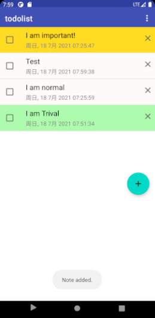

    

         
        
    

         
    

        
	

       
Android 应用开发：7月16日作业
     
	 
    <table style="border:none;text-align:center;width:90%;font-family:仿宋;font-size:14px; margin: 0 auto;line-height:1.5">
    <tbody style="font-family:方正公文仿宋;font-size:16pt;">
        <tr style="font-weight:normal;"> 
    		<td style="width:20%;text-align:right;">姓　　名</td>
    		<td style="width:2%">：</td> 
    		<td style="width:40%;font-weight:normal;border-bottom: 1px solid;text-align:center;font-family:华文仿宋">余东骏</td>     </tr>
        <tr style="font-weight:normal;"> 
    		<td style="width:20%;text-align:right;">学　　号</td>
    		<td style="width:2%">：</td> 
    		<td style="width:40%;font-weight:normal;border-bottom: 1px solid;text-align:center;font-family:华文仿宋">191250186</td>     </tr>
    	<tr style="font-weight:normal;"> 
    		<td style="width:20%;text-align:right;">指导教师</td>
    		<td style="width:2%">：</td> 
    		<td style="width:40%;font-weight:normal;border-bottom: 1px solid;text-align:center;font-family:华文仿宋"> 王中山 </td>     </tr>
    	<tr style="font-weight:normal;"> 
    		<td style="width:20%;text-align:right;">日　　期</td>
    		<td style="width:2%">：</td> 
    		<td style="width:40%;font-weight:normal;border-bottom: 1px solid;text-align:center;font-family:华文仿宋">2021年7月18日</td>     </tr>
    </tbody>              
    </table>

[toc]

## 题目要求

### 本地存储与网络部分

#### 基础版 `To-do List`

❏ 点击各个note前边的checkbox能把该条note置为“已完成”，并更新数据库和UI；

❏ 点击每个note后边的x能把该条note删除，并更新数据库和UI.

#### Pro版 `To-do List`

❏ 升级升级原数据库，增加“优先级”字段；

❏ 创建note时可以选择优先级；

❏ 优先级越高todo的显示在越顶部。

### 多媒体部分

#### 基础版 视频播放器

❏ 播放、暂停功能；

❏ 播放进度条展示（包括时间显示）、点击/滑动跳转到指定位置。

❏ 横竖屏切换、横屏时展示全屏模式。

#### Pro版 视频播放器

❏将app注册为播放器类型(`Action`为`ACTION_VIEW`，`Data`为`Uri`，`Type`为其`MIME`类型)，点击打开系统视频文件时，可以选择使用自制播放器。

## 已实现内容

### `To-do List` 部分

> 所有项目文件在`Chapter-7`目录下。

#### `To-do List` 列表部分

启动应用，可以看到待办事项列表页面。不同优先级别的代办项目以不同的颜色标识。优先级共分为3级，`TRIVIAL` 不重要，以`#CC98FB98`标识；`NORMAL` 普通，以`#FFFFFAFA`标识；`IMPORTANT`重要，以`#DCFFD700`标识。排序时，先按照==优先级==倒序排序，后按照==创建时间==倒序排序。

用户可以点击勾选框改变该条目的已完成/未完成状况。如果该条目被标志已完成，则会如下显示。

点击待办项目右侧的:negative_squared_cross_mark:，可以删除该条目。且屏幕下方会有`Toast`提示。

#### 新增待办事项页面

如图，用户可以在此页面输入新增待办事项的优先级与具体内容。添加成功后，屏幕下方会有`Toast`提示。

#### 文件读写

如图所示。

### 多媒体部分

> 所有项目文件在`assignment`目录下。
>
> 具体展示效果在 `视频播放器画面演示.mp4` 中。

基于`ijkplayer`实现了基础部分的所有要求。